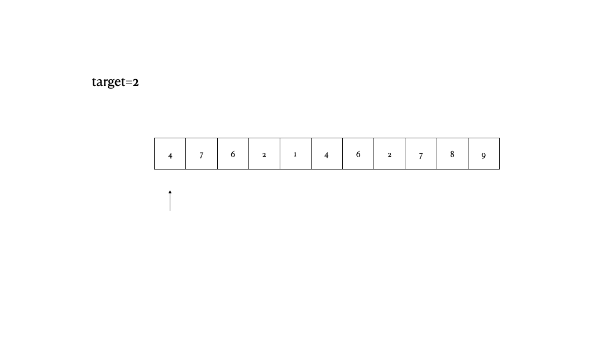
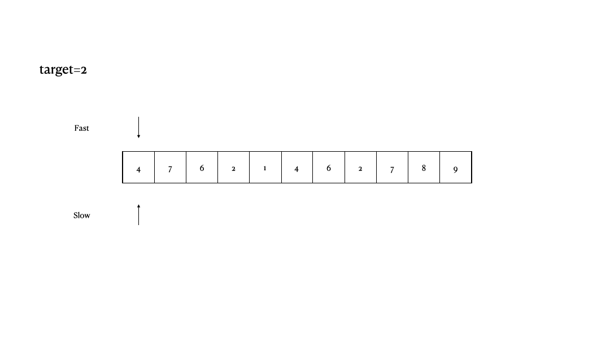

[//]: # (---)

[//]: # (hide:)

[//]: # (  - toc)

[//]: # (  - feedback)

[//]: # (---)


&emsp;&emsp; **给你一个数组 `nums`和一个值 `val`，你需要 原地 移除所有数值等于`val`的元素，并返回移除后数组的新长度。
不要使用额外的数组空间，你必须仅使用`O(1)`额外空间并`原地`修改输入数组。
元素的顺序可以改变，你不需要考虑数组中超出新长度后面的元素。**

示例 1：

    输入：nums = [3,2,2,3], val = 3
    输出：2, nums = [2,2]
    解释：函数应该返回新的长度 2, 并且 nums 中的前两个元素均为 2。你不需要考虑数组中超出新长度后面的元素。例如，函数返回的新长度为 2 ，而 nums = [2,2,3,3] 或 nums = [2,2,0,0]，也会被视作正确答案。

示例 2：

    输入：nums = [0,1,2,2,3,0,4,2], val = 2
    输出：5, nums = [0,1,4,0,3]
    解释：函数应该返回新的长度 5, 并且 nums 中的前五个元素为 0, 1, 3, 0, 4。注意这五个元素可为任意顺序。你不需要考虑数组中超出新长度后面的元素。

提示：

    0 <= nums.length <= 100
    0 <= nums[i] <= 50
    0 <= val <= 100

## 解法

- 暴力破解:
{ align=left }
:  两层for循环，一个for循环遍历数组元素 ，第二个for循环更新数组。
    === "C++  时间复杂度：O(n^2) 空间复杂度：O(1)"
        ```
        class Solution {
        public:
        int removeElement(vector<int>& nums, int val) {
            int size = nums.size();
            for (int i = 0; i < size; i++) {
                if (nums[i] == val) { // 发现需要移除的元素，就将数组集体向前移动一位
                    for (int j = i + 1; j < size; j++) {
                        nums[j - 1] = nums[j];
                    }
                    i--; // 因为下标i以后的数值都向前移动了一位，所以i也向前移动一位
                    size--; // 此时数组的大小-1
                }
            }
            return size;
        }
        };
        ```

- 双指针:

:  双指针法（快慢指针法）： 
:   - 通过一个快指针和慢指针在一个for循环下完成两个for循环的工作。
:   - 快指针：寻找新数组的元素 ，新数组就是不含有目标元素的数组
:   - 慢指针：指向更新 新数组下标的位置
    === "C++  时间复杂度：O(n)   空间复杂度：O(1)"
        ```
        class Solution {
        public:
            int removeElement(vector<int>& nums, int val) {
                int slowIndex = 0;
                for (int fastIndex = 0; fastIndex < nums.size(); fastIndex++) {
                    if (val != nums[fastIndex]) {
                        nums[slowIndex++] = nums[fastIndex];
                    }
                }
                return slowIndex;
            }
        };
        ```

    