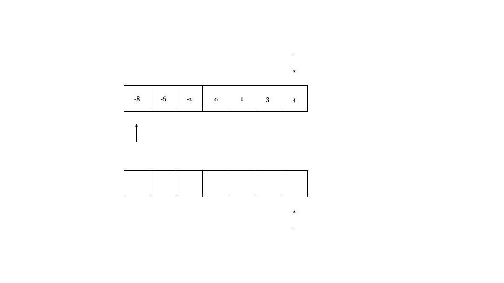

&emsp;&emsp; **给你一个按 非递减顺序 排序的整数数组 `nums`，返回每个数字的平方组成的新数组，要求也按非递减顺序排序。**

示例 1：

    输入：nums = [-4,-1,0,3,10]
    输出：[0,1,9,16,100]
    解释：平方后，数组变为 [16,1,0,9,100]
    排序后，数组变为 [0,1,9,16,100]

示例 2：

    输入：nums = [-7,-3,2,3,11]
    输出：[4,9,9,49,121]

提示：

    1 <= nums.length <= 104
    -104 <= nums[i] <= 104
    nums 已按 非递减顺序 排序

## 解法
- 双指针法:

:   数组平方的最大值就在数组的两端，不是最左边就是最右边，不可能是中间。
:   此时可以考虑双指针法了，i指向起始位置，j指向终止位置。
:   定义一个新数组result，和A数组一样的大小，让k指向result数组终止位置。
:   - 如果`A[i] * A[i] < A[j] * A[j]` 那么`result[k--] = A[j] * A[j]`; 
:   - 如果`A[i] * A[i] >= A[j] * A[j]` 那么`result[k--] = A[i] * A[i]`; 
:   

```
class Solution {
public:
    vector<int> sortedSquares(vector<int>& A) {
        int k = A.size() - 1;
        vector<int> result(A.size(), 0);
        for (int i = 0, j = A.size() - 1; i <= j;) { // 注意这里要i <= j，因为最后要处理两个元素
            if (A[i] * A[i] < A[j] * A[j])  {
                result[k--] = A[j] * A[j];
                j--;
            }
            else {
                result[k--] = A[i] * A[i];
                i++;
            }
        }
        return result;
    }
};//时间复杂度为O(n)
```

- 暴力排序:

:   每个数平方之后，排个序

```
class Solution {
public:
    vector<int> sortedSquares(vector<int>& A) {
        for (int i = 0; i < A.size(); i++) {
            A[i] *= A[i];
        }
        sort(A.begin(), A.end()); // 快速排序
        return A;
    }
};
```