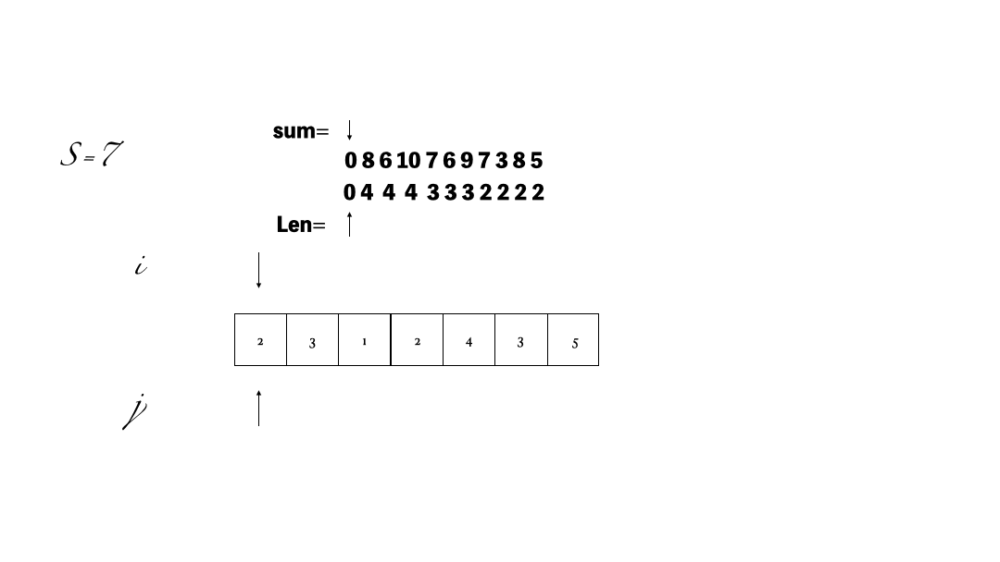

&emsp;&emsp; **给定一个含有`n`个正整数的数组和一个正整数 `target` , 找出该数组中满足其和 `≥` `target` 的长度最小的 连续子数组`[numsl, numsl+1, ..., numsr-1, numsr]` ，并返回其长度。如果不存在符合条件的子数组，返回 `0` 。**

示例 1：

    输入：target = 7, nums = [2,3,1,2,4,3]
    输出：2
    解释：子数组 [4,3] 是该条件下的长度最小的子数组。


示例 2：

    输入：target = 4, nums = [1,4,4]
    输出：1

示例 3：

    输入：target = 11, nums = [1,1,1,1,1,1,1,1]
    输出：0

提示：

    1 <= target <= 109
    1 <= nums.length <= 105
    1 <= nums[i] <= 105

## 解法
- 滑动窗口: 

    窗口就是 满足其和 ≥ s 的长度最小的 连续 子数组。
    窗口的起始位置如何移动：如果当前窗口的值大于s了，窗口就要向前移动了（也就是该缩小了）。
    窗口的结束位置如何移动：窗口的结束位置就是遍历数组的指针，也就是for循环里的索引。



```
class Solution {
public:
    int minSubArrayLen(int s, vector<int>& nums) {
        int result = INT32_MAX;
        int sum = 0; // 滑动窗口数值之和
        int i = 0; // 滑动窗口起始位置
        int subLength = 0; // 滑动窗口的长度
        for (int j = 0; j < nums.size(); j++) {
            sum += nums[j];
            // 注意这里使用while，每次更新 i（起始位置），并不断比较子序列是否符合条件
            while (sum >= s) {
                subLength = (j - i + 1); // 取子序列的长度
                result = result < subLength ? result : subLength;
                sum -= nums[i++]; // 这里体现出滑动窗口的精髓之处，不断变更i（子序列的起始位置）
            }
        }
        // 如果result没有被赋值的话，就返回0，说明没有符合条件的子序列
        return result == INT32_MAX ? 0 : result;
    }
}; //时间复杂度：O(n) 空间复杂度：O(1)
```

- 暴力解法: 

    双重`for`循环，枚举所有可能的结果，然后再比较。

```
class Solution {
public:
    int minSubArrayLen(int s, vector<int>& nums) {
        int result = INT32_MAX; // 最终的结果
        int sum = 0; // 子序列的数值之和
        int subLength = 0; // 子序列的长度
        for (int i = 0; i < nums.size(); i++) { // 设置子序列起点为i
            sum = 0;
            for (int j = i; j < nums.size(); j++) { // 设置子序列终止位置为j
                sum += nums[j];
                if (sum >= s) { // 一旦发现子序列和超过了s，更新result
                    subLength = j - i + 1; // 取子序列的长度
                    result = result < subLength ? result : subLength;
                    break; // 因为我们是找符合条件最短的子序列，所以一旦符合条件就break
                }
            }
        }
        // 如果result没有被赋值的话，就返回0，说明没有符合条件的子序列
        return result == INT32_MAX ? 0 : result;
    }
}; //时间复杂度：O(n^2) 空间复杂度：O(1)
```
