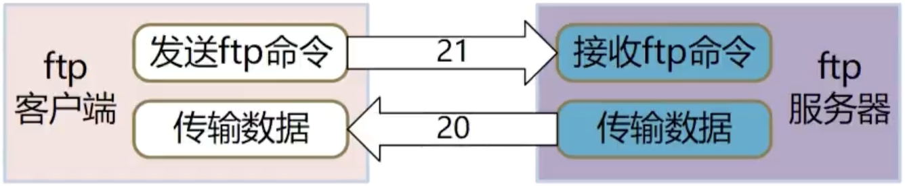
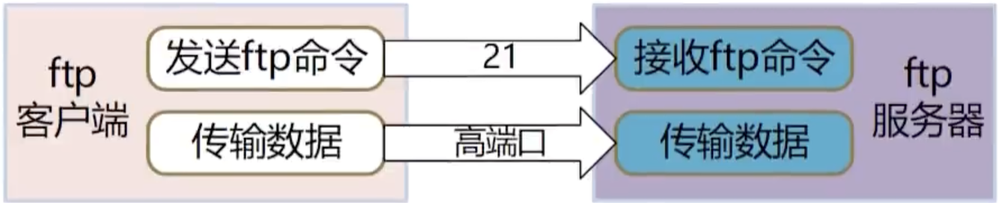

# **Ftp**

## **简介**
- ftp（File Transfer Protocol文件传输协议）是基于TCP/IP 协议的应用层协议，用于文件的传输，包括ftp服务器（或服务端）和ftp客户端
- ftp客户端与服务器创建网络连接，请求登录服务器，登录成功后，就可以进行文件传输，主要包括开载文件和上传文件两种操作
- 适用于在内部网络环境中进行文件传输，系统之间
- 效率低，简单，通用

## **安装**

- 安装ftp服务器
    - apt -y install vsftpd
- 安装ftp客户端
    - apt -y install ftp

## **配置ftp服务器**

- tp的传输模式有被动模式和主动模式两种，缺省是被动模式，主动模式的应用场景极少


1. 关闭SELINUX
    - 修改/etc/selinux/config文件，把SELINUX参数的值改为disabled
    - SELINUX =disabled
    - 重启linux系统或执行 setenforce 0 使修改马上生效

2. 配置ftp数据端口参数
    - tp的数据端口也称为高端口，在/etc/vsftpd/vsftpd.conf文件中配置，由pasv_min_port和pasv_max_port两个参数指定，如果文件中没有这两个参数，手工的加进去
    - pasv_min_port=5000   # 高端口范围的最小值
    - pasv_max_port=5500   # 高端口范围的最大值
    - pasv_address=129.146.16.141


3. 开通防火墙
- 开通防火墙的方法有两种：
    - 开通ftp服务
    firewall-cmd --zone=public --add-service=ftp --permanent
    - 开通ftp服务需要的端口，21是控制端口，5000-5500是数据端口范围，也就是上一节中在/etc/vsftpd/vsftpd.conf文件中配置的pasv_min_port和pasv_max_port参数。
        - firewall-cmd --zone=public --add-port=21/tcp --permanent
        - firewall-cmd --zone=public --add-port=5000-5500/tcp --permanent
- 重启防火墙：
    - systemctl restart firewalld.service

4. 	设置被动模式的外部IP地址:
    - 如果服务器在NAT或防火墙后面，设置外部可访问的IP地址：
    - `pasv_address=您的外部IP地址`


## **启动vsftpd服务**
- ftp服务器的服务名是vsftpd，相关的操作如下：

    ```c++
    systemctl start    vsftpd   # 启动服务。
    systemctl stop    vsftpd    # 停止服务。
    systemctl restart vsftpd    # 重启服务。
    systemctl status  vsftpd    # 查看服务状态。
    systemctl enable  vsftpd    # 启用开机自启动vsftpd服务。
    systemctl disable vsftpd    # 禁用开机自启动vsftpd服务。
    ```

## **云平台访问策略配置**
- 如果是云服务器上，需要登录云服务器提供商的管理平台开通访问策略（或安全组），开通21和高端口的访问策略。
- 不同云服务器提供商的管理平台操作方法不同，具体操作方法阅读操作手册、或者百度，或者咨询云服务器提供商的客服。
- 如果不是上述的问题，云服务器的ftp服务还不能建立数据会话，解决的方法是关闭PASV模式的安全检查，在/etc/vsftpd/vsftpd.conf中增加以下行。
    - pasv_promiscuous=yes


## **Ftp两种模式**
- 分别是port模式（主动模式）和pasv模式（被动模式）

- 主动模式
    - 客户端给服务端的21端口发命令说：我要输传文件，我已经打开了自己的20端口，你向我的20端口发起TCP连接，我们来传输文件
    - 服务端收到客户端的请求后，就会主动向客户端的20端口发起连接，连接成功后开始传输文件

    

    - 在主动模式下，ftp请求是由客户端TCP连接的；传输数据的时候，TCP连接却是由服务端发起的


- 被动模式
    - 客户端给服务器端的21端口发命令说：我要传输文件
    - 服务器端收到客户端的请求后，打开一个空闲的高端口，然后告诉客户端，我已经打开了某某端口，你向我这个端口发起TCP连接，然后我们用这个端口来传输文件

    


