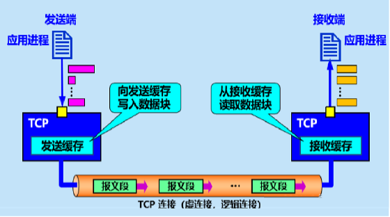

# **TCP 缓存**

- 系统为每个socket创建了发送缓冲区和接收缓冲区
    - 应用程序调用send()/write()函数发送数据的时候，内核把数据从应用进程拷贝socket的发送缓冲区中；
    - 应用程序调用recv()/read()函数接收数据的时候，内核把数据从socket的接收缓冲区拷贝应用进程中
    - 发送数据即把数据放入发送缓冲区中
    - 接收数据即从接收缓冲区中取数据

    
    
- 查看socket缓存的大小：
    ```c++
    int bufsize = 0;
    socklen_t optlen = sizeof(bufsize);     
    
    getsockopt(sockfd, SOL_SOCKET, SO_SNDBUF, &bufsize, &optlen); // 获取发送缓冲区的大小。
    cout << "send bufsize=" << bufsize << endl;
    
    getsockopt(sockfd, SOL_SOCKET, SO_RCVBUF, &bufsize, &optlen); // 获取接收缓冲区的大小。
    cout << "recv bufsize=" << bufsize << endl;
    ```

- 问题：
    1. send()函数有可能会阻塞吗？ 
        - 如果自己的发送缓冲区和对端的接收缓冲区都满了，会阻塞。
    2. 向socket中写入数据后，如果关闭了socket，对端还能接收到数据吗？
        - 可以，客户端发送的数据存放在服务端的接受缓冲区中 

## 分包/粘包
- 分包：
    - tcp报文的大小缺省是 1460 字节，如果发送缓冲区中的数据超过1460字节，tcp将拆分成多个包发送，如果接收方及时的从接收缓冲区中取走了数据，看上去像就接收到了多个报文
    - 发送方发送字符串  "helloworld"，接收方却接收到了两个字符串 "hello" 和 “world"

- 粘包：
    - tcp接收到数据之后，有序放在接收缓冲区中，数据之间不存在分隔符的说法，如果接收方没有及时的从缓冲区中取走数据，看上去就象粘在了一起
    - 发送方发送两个字符串 "hello" 和 “world"，接收方却一次性接收到了"helloworld"

- 区分报文：
    - 报文长度 (4字节的整数) +报文内容

- 发送报文的方法：
    - 先发送报文长度，再发送报文内容
    - 例如：Hello world，先发送11，再发送Hello world

## **Nagle算法**
- 在TCP协议中，无论发送多少数据，都要在数据前面加上协议头，同时，对方收到数据后，也需要回复ACK表示确认。为了尽可能的利用网络带宽，TCP希望每次都能够以MSS（Maximum Segment Size，最大报文长度）的数据块来发送数据
- Nagle算法就是为了尽可能发送大块的数据，避免网络中充斥着小数据块
- Nagle算法的定义是：任意时刻，最多只能有一个未被确认的小段，小段是指小于MSS的数据块，未被确认是指一个数据块发送出去后，没有收到对端回复的ACK
- 举个例子：
    - 发送端调用send()函数将一个int型数据（称之为A数据块）写入到socket中，A数据块会被马上发送到接收端，接着，发送端又调用send()函数写入一个int型数据（称之为B数据块），这时候，A块的ACK没有返回（已经存在了一个未被确认的小段），所以B块不会立即被发送，而是等A块的ACK返回之后（大概40ms）才发送
    - TCP协议中不仅仅有Nagle算法，还有一个ACK延迟机制：当接收端收到数据之后，并不会马上向发送端回复ACK，而是延迟40ms后再回复，它希望在40ms内接收端会向发送端回复应答数据，这样ACK就可以和应答数据一起发送，把ACK捎带过去
    - 如果TCP连接的一端启用了Nagle算法，另一端启用了ACK延时机制，而发送的数据包又比较小，则可能会出现这样的情况：发送端在等待上一个包的ACK，而接收端正好延迟了此ACK，那么这个正要被发送的包就会延迟40ms
- 解决方案
    - 开启TCP_NODELAY选项，这个选项的作用就是禁用Nagle算法
    ```c++
    #include <netinet/tcp.h>   // 注意，要包含这个头文件。
    int opt = 1;   
    setsockopt(sockfd, IPPROTO_TCP, TCP_NODELAY,&opt,sizeof(opt));
    ```

    - 对时效要求很高的系统，例如联机游戏、证券交易，一般会禁用Nagle算法
