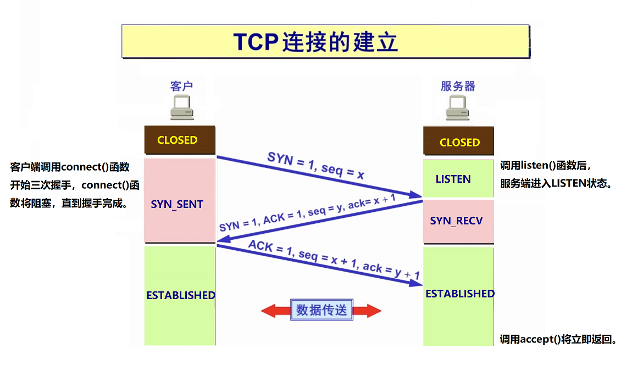
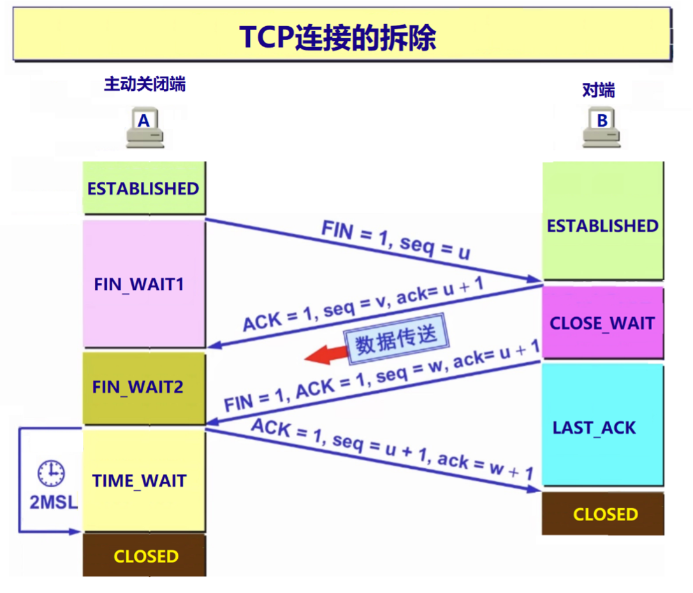

# **三次握手与四次挥手**

- TCP是面向连接的、可靠的协议，建立TCP连接需要三次对话（三次握手），拆除TCP连接需要四次对话（四次握/挥手）

## **三次握手**

- 服务端调用listen()函数后进入监听（等待连接）状态，这时候，客户端就可以调用connect()函数发起TCP连接请求，
    - connect()函数会触发三次握手，三次握手完成后，客户端和服务端将建立一个双向的传输通道
    
        

    - 情景类似：
        1. 客户端对服务端说：我可以给你发送数据吗？ (请求建立客户端到服务端的单向传输通道)
        2. 服务端回复：ok，不过，我也要给你发送数据。（对请求建立通道的回应，客户端至服务端的单向传输通道已建立，请求建立服务到端客户端的单向传输通道）
        3. 客户端回复：ok。（对请求建立通道的回应，服务端至客户端的单向传输通道已建立）
    - 三次握手后，客户端和服务端的双向传输通道就建立了，可以开始进行数据传输了
    - 细节：
        1. 客户端的socket也有端口号，对程序员来说，不必关心客户端socket的端口号，所以系统随机分配。（socket通讯中的地址包括ip和端口号，但是，习惯中的地址仅指ip地址）
        2. 服务端的bind()函数，普通用户只能使用1024以上的端口，root用户可以使用任意端口。
        3. listen()函数的第二个参数+1为已连接队列（ESTABLISHED状态，三次握手已完成但是没有被accept()的socket，只存在于服务端）的大小。（在高并发的服务程序中，该参数应该调大一些）
        4. SYN_RECV状态的连接也称为半连接。
        5. CLOSED是假想状态，实际上不存在。


## **四次挥手**

- 断开一个TCP连接时，客户端和服务端需要相互总共发送四个包以确认连接的断开
    - 在socket编程中，这一过程由客户端或服务端任一方执行close()函数触发

        
    
- 情景类似：
    1. 一端（A）对另一端（B）说：我不会给你发数据了，断开连接吧
    2. B回复：ok。（这时候A不能对B发数据了，但是，B仍可以对A发数据）
    3. B发完数据了，对A说：我也不会给你发数据了。（这时候B也不能对A发数据了）
    4. A回复：ok

- 细节：
    1. 主动断开的端在四次挥手后，socket的状态为TIME_WAIT，该状态将持续2MSL（30秒/1分钟/2分钟）。 MSL（Maximum Segment Lifetime）报文在网络上存在的最长时间，超过这个时间报文将被丢弃。
    2. 如果是客户端主动断开，TIME_WAIT状态的socket几乎不会造成危害
        1. 客户端程序的socket很少，服务端程序的socket很多（成千上万）
        2. 客户端的端口是随机分配的，不存在重用的问题。
    3. 如果是服务端主动断开，有两方面的危害：a）socket没有立即释放；b）端口号只能在2MSL后才能重用。

- 在服务端程序中，解决端口重用问题，用setsockopt()函数设置socket的属性（一定要放在bind()之前）
    ```c++
    int opt = 1;   
    setsockopt(m_listenfd,SOL_SOCKET,SO_REUSEADDR,&opt,sizeof(opt));
    ```
