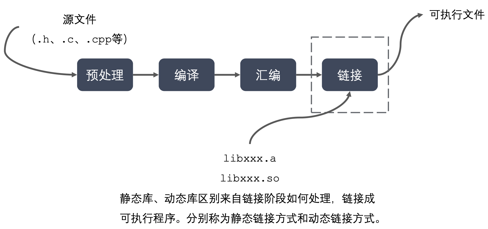

[//]: # (---)

[//]: # (hide:)

[//]: # (  - toc)

[//]: # (  - feedback)

[//]: # (---)

## **简介**

- `GCC` 原名为 `GNU` `C`语言编译器(`GNU C Compiler`)
- `GCC(GNU Compiler Collection，GNU编译器套件)`是由 `GNU` 开发的编程语言译器。`GNU` 编译器套件包括 `C、C++、Objective-C、Java、Ada 和 Go` 语言前端，也包括了这些语言的库(如 `libstdc++，libgcj`等)
- `GCC` 不仅支持 `C` 的许多“方言”，也可以区别不同的 C 语言标准;可以使用命令行选项来控制编译器在翻译源代码时应该遵循哪个 C 标准。例如，当使用命令行参数`-std=c99` 启动 GCC 时，编译器支持 C99 标准。
- 安装命令 `sudo apt install gcc g++` (版本 > 4.8.5)
- 查看版本 `gcc/g++ -v/--version`

## **编程语言的发展**
[//]: # (![avatar]&#40;data:image/png;base64,)

## **GCC工作流程**

## **程序编译成可执行程序的过程**

## **代码操作**

- 预理：   `gcc test.c  -E -o test.i`
- 编译：   `gcc test.i  -S -o test.s`
- 汇编：   `gcc test.s  -c -o test.o`
- 程序：   `gcc test.o  -o  test.out`

## **GCC常用参数选项**

|                 gcc编译选项                 |                          说明                           |
|:---------------------------------------:|:-----------------------------------------------------:|
|                   -E                    |            预处理指定的源文件，不进行编译预处理指定的源文件，不进行编译             |
|                   -S                    |                    预处理指定的源文件，不进行编译                    |
|                   -c                    |                  编译、汇编指定的源文件，但是不进行链接                  |
| -o [file1] [file2] / [file2] -o [file1] |               将文件 file2 编译成可执行文件 file1                |
|              -I directory               |                 指定 include 包含文件的搜索目录                  |
|                   -g                    |               在编译的时候，生成调试信息，该程序可以被调试器调试               |
|                   -D                    |                    在程序编译的时候，指定一个宏                     |
|                   -w                    |                       不生成任何警告信息                       |
|                  -Wall                  |                       生成所有警告信息                        |
|                   -On                   | n的取值范围:0~3。编译器的优化选项的4个级别，-O0表 示没有优化，-O1为缺省值，-O3优化级别最高 |
 |                   -l                    |                    在程序编译的时候，指定使用的库                    |
|                   -L                    |                   指定编译的时候，搜索的库的路径。                    |
|               -fPIC/fpic                |                      生成与位置无关的代码                       |
|                 -shared                 |                  生成共享目标文件，通常用在建立共享库时                  |
|                  -std                   |            指定C方言，如:-std=c99，gcc默认的方言是GNU C            |

## **GCC/G++ 区别**

    gcc和g++都是GNU(组织)的一个编译器。

误区一: `gcc` 只能编译 `c`代码，`g++` 只能编译 `c++`代码。两者都可以，请注意

:   - 后缀为 `.c` 的，`gcc` 把它当作是 `C` 程序，而 `g++` 当作是 `c++`程序
:   - 后缀为 `.cpp` 的，两者都会认为是 `C++` 程序，`C++` 的语法规则更加严谨一些 
:   - 编译阶段，`g++` 会调用 `gcc`，对于 `C++` 代码，两者是等价的，但是因为 `gcc` 命令不能自动和 `C++` 程序使用的库联接，所以通常用 `g++` 来完成链接，为了统 一起见，干脆编译/链接统统用 `g++` 了

误区二: `gcc`不会定义`__cplusplus`宏，而`g++`会

:   - 实际上，这个宏只是标志着编译器将会把代码按`C`还是`C++`语法来解释
:   - 如上所述，如果后缀为`.c`，并且采用`gcc`编译器，则该宏就是未定义的，否则，就是已定义

误区三: 编译只能用 gcc，链接只能用 g++

:   - 严格来说，这句话不算错误，但是它混淆了概念，应该这样说:编译可以用`gcc/g++`，而链接可以用`g++`或者`gcc -lstdc++`
:   - `gcc`命令不能自动和`C++`程序使用的库联接，所以通常使用`g++`来完成联接。但在编译阶段，`g++`会自动调用`gcc`，二者等价

