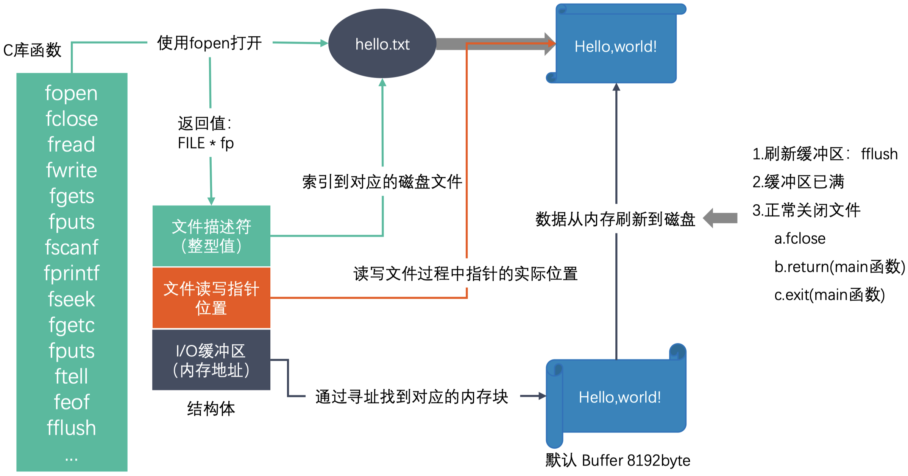
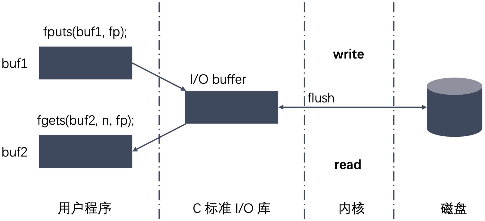
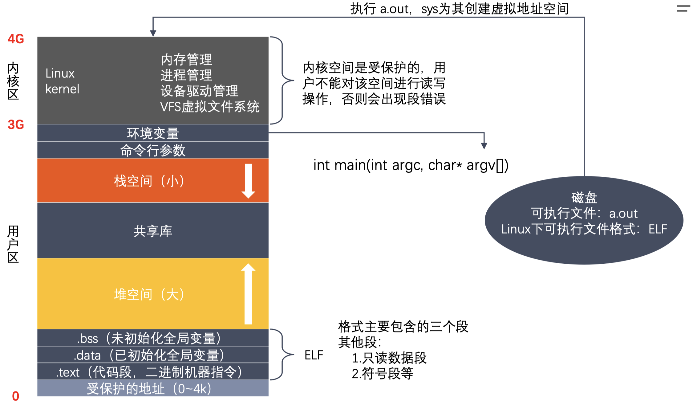
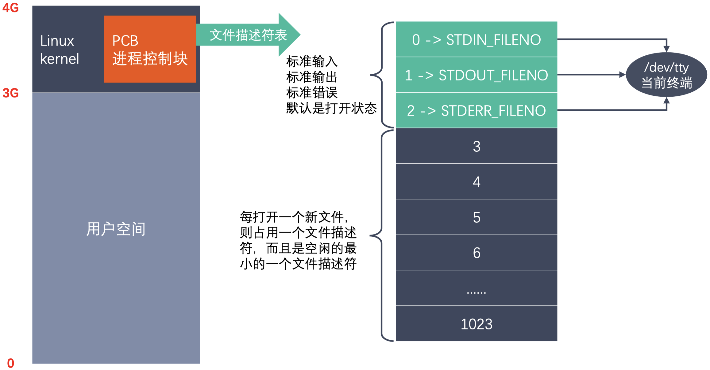
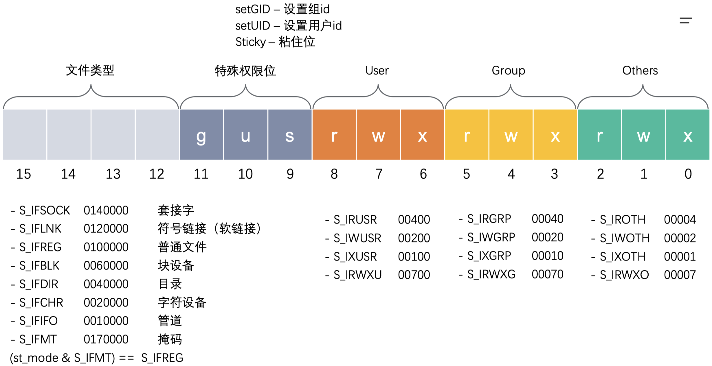

## **标准 C 库 IO 函数**


## **标准C库IO和Linux系统IO的关系**


## **虚拟地址空间**


## **文件描述符**


## **Linux 系统 IO 函数**
```
int open(const char *pathname, int flags);
int open(const char *pathname, int flags, mode_t mode); 
int close(int fd);
ssize_t read(int fd, void *buf, size_t count);
ssize_t write(int fd, const void *buf, size_t count); 
off_t lseek(int fd, off_t offset, int whence);
int stat(const char *pathname, struct stat *statbuf);
int lstat(const char *pathname, struct stat *statbuf);
```
## **stat 结构体**
```
struct stat {
    dev_t  st_dev; // 文件的设备编号
    ino_t  st_ino;  // 节点
    mode_t   st_mode;  // 文件的类型和存取的权限
    nlink_t  st_nlink;  // 连到该文件的硬连接数目
    uid_t   st_uid;   // 用户ID
    gid_t   st_gid;   // 组ID
    dev_t   st_rdev;  // 设备文件的设备编号
    off_t   st_size;  // 文件字节数(文件大小)
    blksize_t st_blksize;   // 块大小
    blkcnt_t   st_blocks;   // 块数
    time_t st_atime;   // 最后一次访问时间
    time_t st_mtime;   // 最后一次修改时间
    time_t  st_ctime;  // 最后一次改变时间(指属性)
};
```
## **st_mode 变量**


## **文件属性操作函数**
```
int access(const char *pathname, int mode);
int chmod(const char *filename, int mode);
int chown(const char *path, uid_t owner, gid_t group); 
int truncate(const char *path, off_t length);
```
## **目录操作函数**
```
int rename(const char *oldpath, const char *newpath); 
int chdir(const char *path);
char *getcwd(char *buf, size_t size);
int mkdir(const char *pathname, mode_t mode);
int rmdir(const char *pathname);
```
## **目录遍历函数**
```
DIR *opendir(const char *name);
struct dirent *readdir(DIR *dirp); 
int closedir(DIR *dirp);
```
## **dirent 结构体和 d_type**
```
struct dirent {
    ino_t d_ino;  // 此目录进入点的inode
    off_t d_off;// 目录文件开头至此目录进入点的位移 
    unsigned short int d_reclen; // d_name 的长度, 不包含NULL字符 
    unsigned char d_type; // d_name 所指的文件类型 
    char d_name[256];   // 文件名
};
```
```
d_type
    DT_BLK - 块设备 
    DT_CHR - 字符设备 
    DT_DIR - 目录 
    DT_LNK - 软连接 
    DT_FIFO - 管道 
    DT_REG - 普通文件 
    DT_SOCK - 套接字 
    DT_UNKNOWN - 未知
```
## **dup、dup2 函数**
```
int dup(int oldfd); 复制文件描述符
int dup2(int oldfd, int newfd); 重定向文件描述符
```
## **fcntl 函数**
```
int fcntl(int fd, int cmd, ... /* arg */ ); 
     复制文件描述符
     设置/获取文件的状态标志
```


