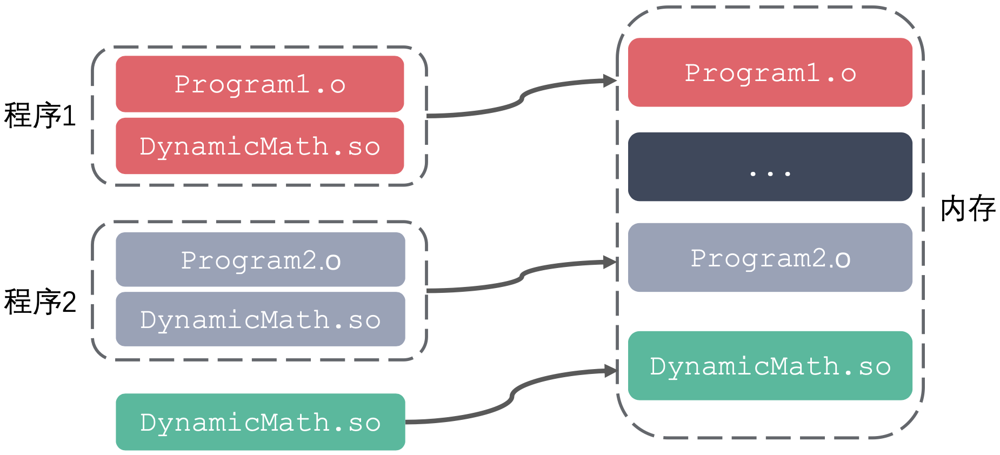
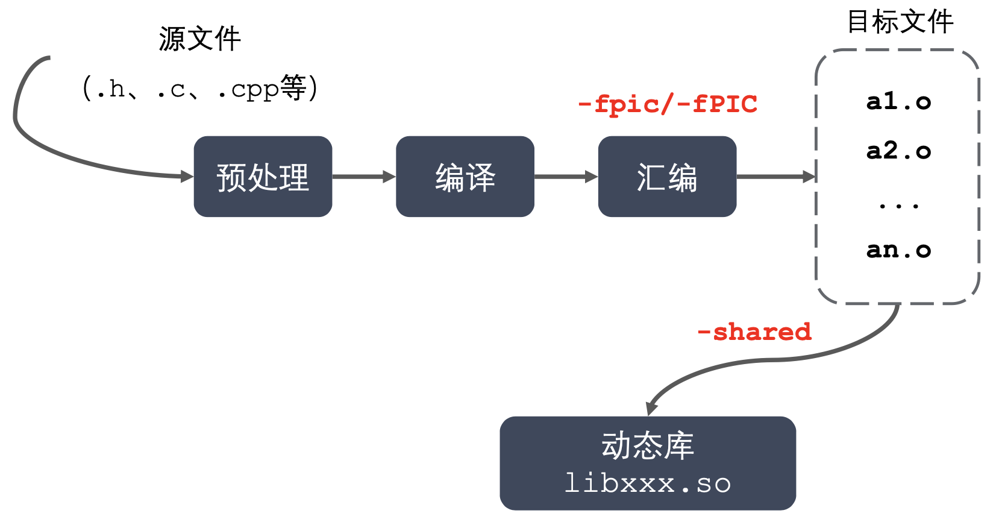

## **命名规则**

1.  `Linux : libxxx.so`
    - `lib` : 前缀(固定) 
    - `xxx` : 库的名字，自己起 
    - `.so` : 后缀(固定)
    - 在`Linux`下是一个可执行文件

2. `Windows : libxxx.lib`

## **工作原理**

1. 静态库: `GCC` 进行链接时，会把静态库中代码打包到可执行程序中
2. 动态库: `GCC` 进行链接时，动态库的代码不会被打包到可执行程序中
3. 程序启动之后，动态库会被动态加载到内存中，通过 `ldd` ` (list dynamic dependencies)`命令检查动态库依赖关系
4.  如何定位共享库文件呢?
    - 当系统加载可执行代码时候，能够知道其所依赖的库的名字，但是还需要知道绝对路径，此时就需要系统的动态载入器来获取该绝对路径。对于`elf`格式的可执行程序，是由`ld-linux.so`来完成的，它先后搜索`elf`文件的`DT_RPATH`段 ——> 环境变量`LD_LIBRARY_PATH ——> /etc/ld.so.cache`文件列表 ——> `/lib/`，`/usr/lib`目录找到库文件后将其载入内存。

## **优缺点**
1.  优点:
    - 可以实现进程间资源共享(共享库)
    - 更新、部署、发布简单
    - 可以控制何时加载动态库
2.  缺点:
    - 消耗系统资源，浪费内存
    - 更新、部署、发布麻烦



## **动态库的制作**



1.  gcc 得到 .o 文件，得到和位置无关的代码
    - `gcc -c -fpic add.c div.c mult.c sub.c`
2.  gcc 得到动态库
    - `gcc -shared add.o  div.o mult.o  sub.o -o libcalc.so`
3.  配置动态库路径
    - `export LD_LIBRARY_PATH=$LD_LIBRARY_PATH:/root/Linux/lesson04/library/lib`
4.  编译代码
```
    .
    ├── include
    │   └── head.h
    ├── lib
    │   └── libcalc.so
    ├── main
    ├── main.c
    └── src
        ├── add.c
        ├── div.c
        ├── mult.c
        └── sub.c
        
```
    - `gcc main.c -o main  -I include/  -L lib/ -l calc`
    
