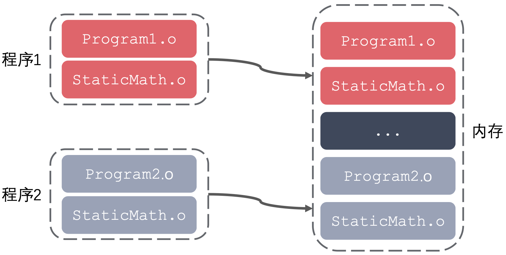
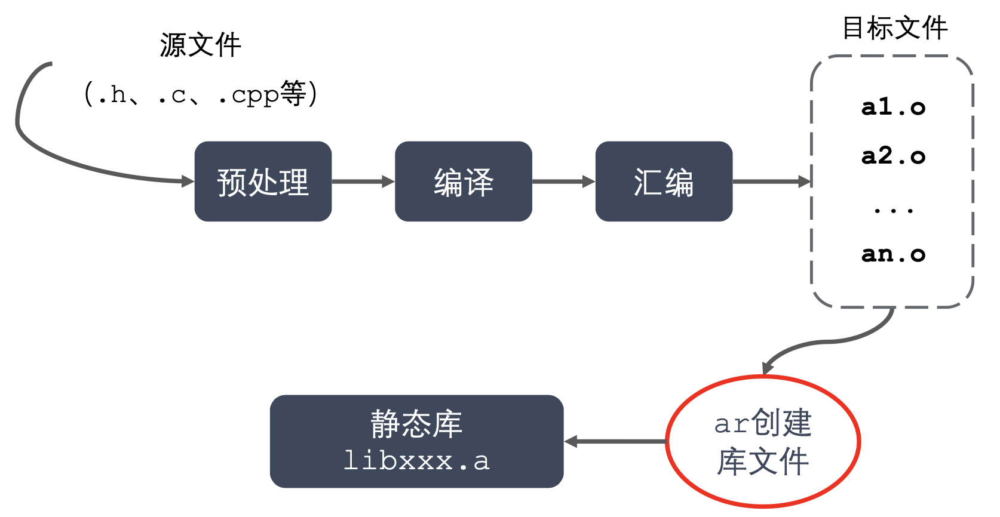

## **库**

1. 库文件是计算机上的一类文件，可以简单的把库文件看成一种代码仓库，它提供给使用者一些可以直接拿来用的变量、函数或类。
2. 库是特殊的一种程序，编写库的程序和编写一般的程序区别不大，只是库不能单独运行。
3. 库文件有两种，静态库和动态库(共享库)，区别是: 静态库在程序的链接阶段被复制到了程序中;动态库在链接阶段没有被复制到程序中，而是程序在运行时由系统动态加载到内存中供程序调用。
4.  库的好处:
    - 代码保密
    - 方便部署和分发

## **命名规则**

1.  `Linux` : `libxxx.a`
    - `lib` : 前缀(固定) 
    - `xxx` : 库的名字，自己起 
    - `.a` : 后缀(固定)

2. `Windows` : `libxxx.lib`

## **优缺点**
1.  优点:
    - 静态库被打包到应用程序中加载速度快
    - 发布程序无需提供静态库，移植方便
2.  缺点:
    - 消耗系统资源，浪费内存
    - 更新、部署、发布麻烦


## **静态库的制作**



1. `gcc` 获得 `.o` 文件
2. 将 `.o` 文件打包，使用 `ar` 工具(`archive`)
3.  `ar rcs libxxx.a xxx.o xxx.o`
    - `r` – 将文件插入备存文件中
    - `c` – 建立备存文件
    - `s` – 索引
```
.
├── add.c
├── div.c
├── head.h
├── main.c
├── mult.c
└── sub.c
```
```
gcc -c add.c div.c mult.c sub.c
```
```
.
├── add.c
├── add.o
├── div.c
├── div.o
├── head.h
├── main.c
├── mult.c
├── mult.o
├── sub.c
```
```
.
├── include
│   └── head.h
├── lib
│   └── libcalc.a
├── main.c
└── src
    ├── add.c
    ├── div.c
    ├── mult.c
    └── sub.c
```
```
gcc main.c -o app -I ./include/ -l calc -L lib
```
```
.
├── app
├── include
│   └── head.h
├── lib
│   └── libcalc.a
├── main.c
└── src
    ├── add.c
    ├── div.c
    ├── mult.c
    └── sub.c
```
